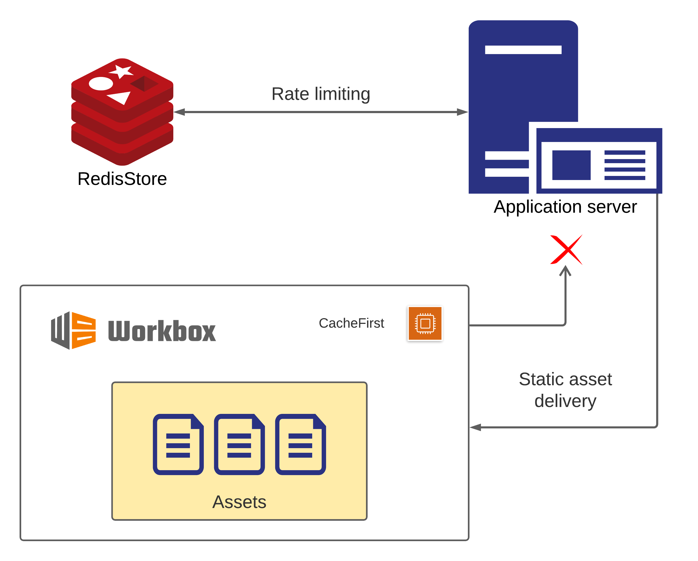
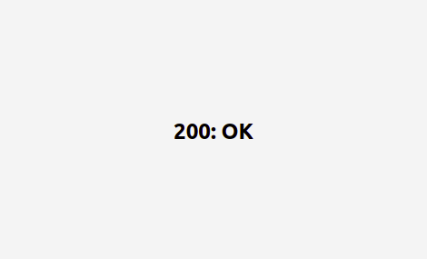
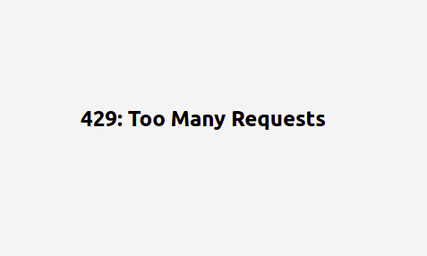

## workbox-redis
Caching implementation and session management ( rate-limiting ) written for web using workbox and redis

<br/>

### Note
- Select caching strategy as per your usecase. 
- Since, my purpose here was to implement caching on **static** assets, hence used *CacheFirst* strategy.

- Architecture below is valid for **single** application server only.

<br/>

### Architecture

  

<br/>

### Screenshots

- Successful request  
  <br/>
  

- Failed request  
  <br/>
  

<br/>

### Usage
- Clone the repository
  ```bash
  git clone https://github.com/Accelerator-One/workbox-redis.git
  ```

- Install the relevant dependencies
  ```bash
  npm install
  ```

- Setup redis cluster for usage ( local | cloud )

- Setup *.env*&nbsp; file with following keys
  ```javascript
  PORT = <port_name>

  SECRET = <secret_name>

  RATE = <rate_in_ms>

  ENDPOINT = redis://<password>@<host>:<port>

  ```

- Start the server
  ```bash
  node index.js
  ```
<br/>

### Issues
In case of any issues while working with the implementation, mark them under *Issues* section of this repository